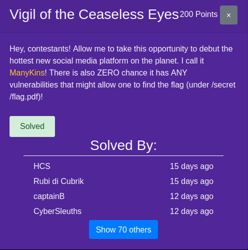
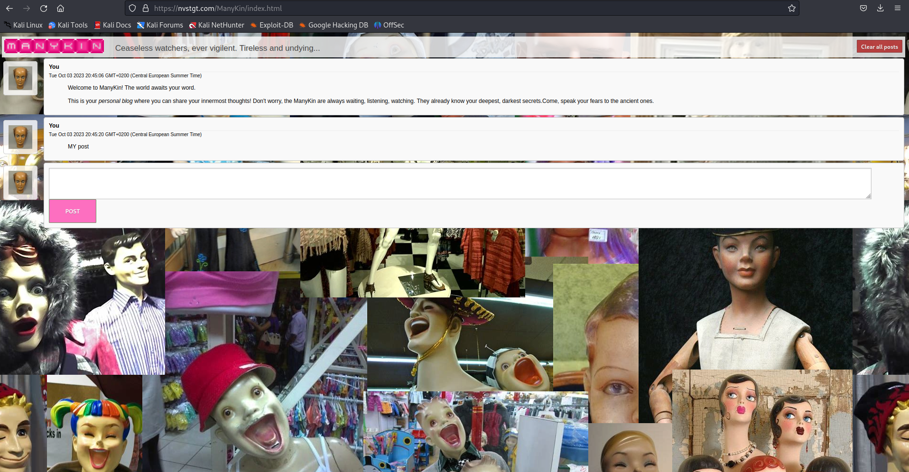
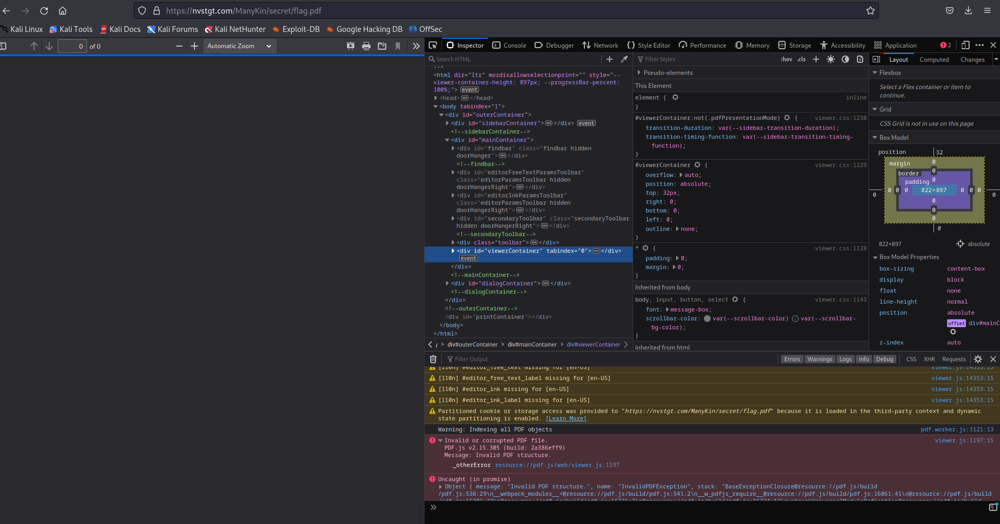
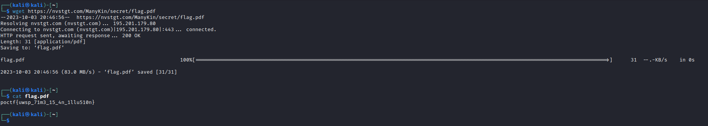

# UWSP Pointer Overflow CTF | WEB | Vigil of the Ceaseless Eyes
by Chris

Participating in the UWSP Pointer Overflow CTF, the "Vigil of the Ceaseless Eyes" challenge caught my attention. Here's a step-by-step walkthrough:

## The Challenge

### Skills Required
* Very basic knowledge of pdf
* Familiarity with the wget command

## Enumeration
### Initial Testing
Upon accessing the application, this is what it looks like:

After some testing, I revisited the challenge description. The Flag is located under "secret/flag.pdf." What if we try to access it directly via the browser?

The error indicates that the content is not in PDF format. How about trying to access it as plain text?

And there we have it—the Flag!

## Tips for the Developer
* Be cautious about the information you share online. Avoid disclosing the location of sensitive information; it might go unnoticed in web scans.

* Secure file permissions. Files should not be accessible by everyone!
