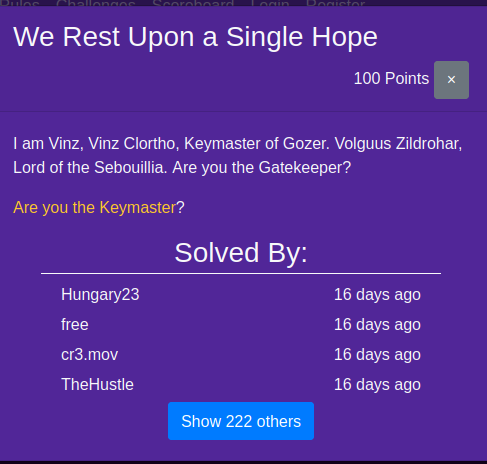
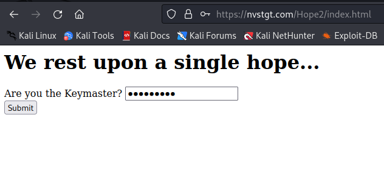
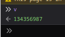

# UWSP Pointer Overflow CTF | WEB | We Rest Upon a Single Hope 
by Chris

This weekend, I took part in the UWSP Pointer Overflow CTF, and my initial challenge was "We Rest Upon a Single Hope." Here's my walkthrough.

## The Challenge


### Skills Required
* Very basic knowledge of JavaScript

## Enumeration
### Testing as normal user
This is how the application looks:



The first thing that caught my eye was that the entered key is transmitted via a GET parameter:


```
https://nvstgt.com/Hope2/index.html?key=testkey
```

Initially, I thought the application processed the key via PHP. However, upon realizing the script only used HTML, I inspected the JavaScript code. The code was:

```javascript

function Gozer(key) {
    var hash = 0, i, chr;
    for (i = 0; i < key.length; i++) {
        chr   = key.charCodeAt(i);
        hash  = ((hash << 5) - hash) + chr;
        hash |= 0;
    }
    return hash;
}
function conv(s)	{
    var a = [];
    for (var n = 0, l = s.length; n < l; n ++) {
        var hex = Number(s.charCodeAt(n)).toString(16);
        a.push(hex);
    }
    return a.join('');
}
function Zuul(key) {
    if (key == v) {
        var Gatekeeper = [];
        var y = [];
        var z = [];
        Gatekeeper[0] = "706f6374667b75777370";
        Gatekeeper[1] = "formal";
        Gatekeeper[2] = "88410";
        for (var i = 0, l = Gatekeeper[0].length; i < l; i ++) {
            if (i == 0 || i % 2 == 0) {
                y += String.fromCharCode(parseInt((Gatekeeper[0].substring(i, i+2)), 16));
            }
        }
        z[0] = y;
        z[1] = Gatekeeper[2][3];
        z[2] = Gatekeeper[2][2] + Gatekeeper[1][3];
        z[3] = z[2][0] + Gatekeeper[1][5] + Gatekeeper[1][5];
        z[4] = (Gatekeeper[2]/12630) + "h" + z[2][0] + (Gatekeeper[2][0]-1);
        z[5] = z[4][0] + z[4][1] + '3' + Gatekeeper[1][2] + '3';
        z[6] = (Gatekeeper[2]/Gatekeeper[2]) + '5';
        z[7] = (Gatekeeper[2]*0) + Gatekeeper[1][0];
        z[8] = (Gatekeeper[2]/12630) + "h" + '3';
        z[9] = Gatekeeper[1][3] + (Gatekeeper[2]*0) + '5' + (Gatekeeper[2][0]-1);
        z[10] = 'r' + '3' + z[2][0] + Gatekeeper[1][5] + '}';
        console.log(z.join("_"));
    } else {
        console.log("Gozer the Traveler. He will come in one of the pre-chosen forms. During the rectification of the Vuldrini, the traveler came as a large and moving Torg! Then, during the third reconciliation of the last of the McKetrick supplicants, they chose a new form for him: that of a giant Slor! Many Shuvs and Zuuls knew what it was to be roasted in the depths of the Slor that day, I can tell you!");
    }
}
var p = navigator.mimeTypes+navigator.doNotTrack;
var o = navigator.deviceMemory;
var c = navigator.vendor+navigator.userAgent;
var t = navigator.product+p;
var f = o+c+p;
var v = Gozer(p/((o+c)*t)+f);
```

The "Zuul(key)" function is executed when the "Submit" button is pressed.


Given that the function checks if the key equals v, I needed to figure out what v is. I did this using a simple command in the browser console.



Then I tried using v as the key.

AND "134356987" was indeed the key, and the flag was printed in the console.


## Tips for the Developer

* For such sensitive functions like comparing a passkey shouldnt be js used without any framework since this is just a very basic "attack". The Developer could also use PHP so the code is not exposed to the attacker
* 
